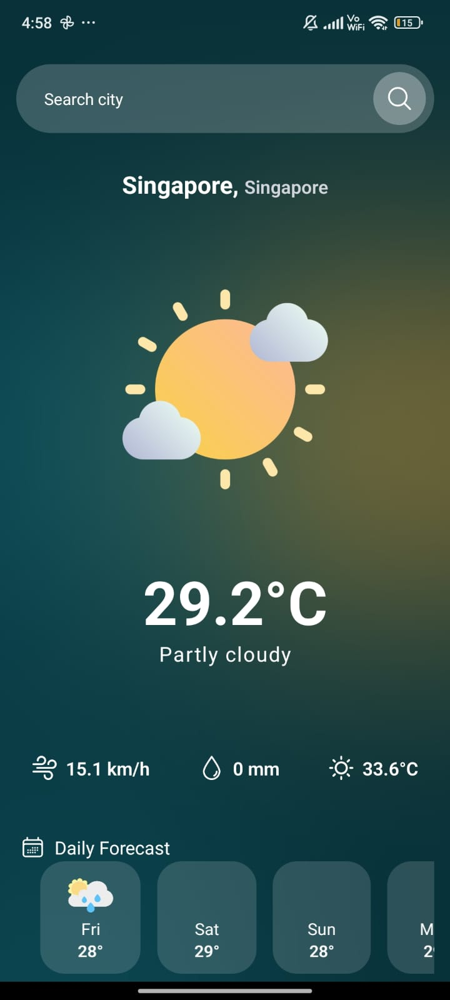
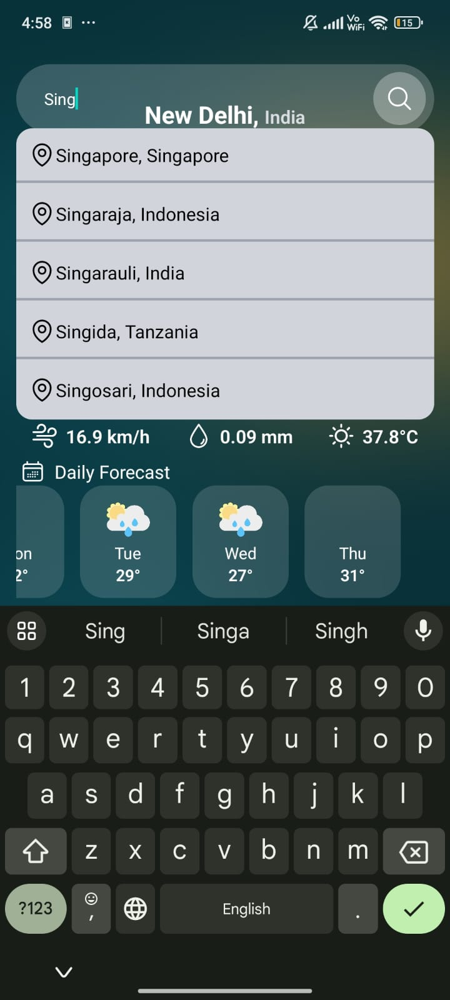
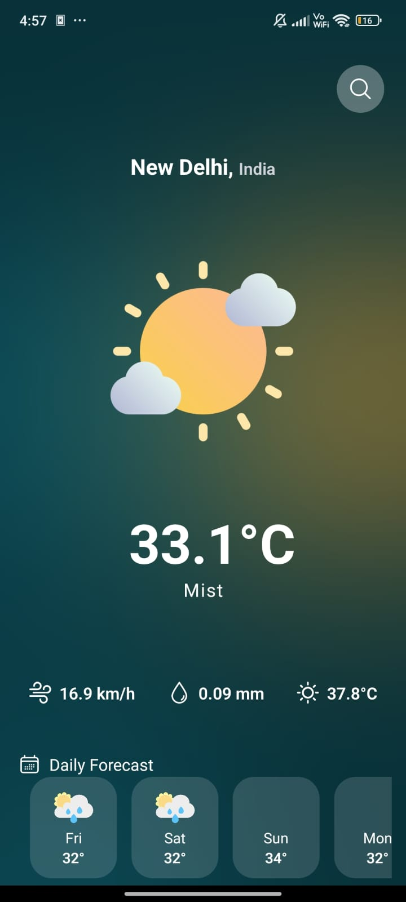
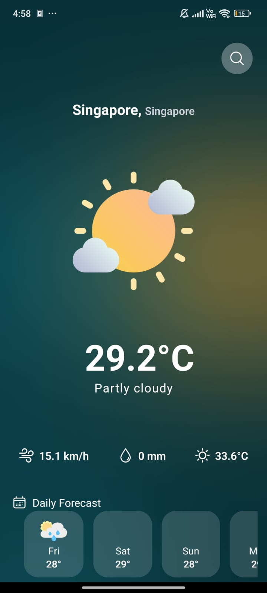

# Weather App 🌦️

A beautiful and functional weather application built with TypeScript and React Native, leveraging a powerful Weather API to provide accurate and up-to-date weather information.

## 📱 Screenshots

  
   
  
  

## ✨ Features

- Real-time weather data for any location 🌍
- Detailed current weather conditions 🌡️
- 7-day weather forecast 📅
- Search functionality for global locations 🔍
- Beautiful UI with dynamic backgrounds 🎨
- Responsive design for various screen sizes 📱

## 🛠️ Technologies Used

- TypeScript
- React Native
- Expo
- Weather API (insert the specific API you're using)
- React Native Heroicons

## 🚀 Getting Started

### Prerequisites

- Node.js
- npm or yarn
- Expo CLI

### Installation

1. Clone the repository:
git clone https://github.com/yourusername/weather-app.git
Copy
2. Navigate to the project directory:
cd weather-app
Copy
3. Install dependencies:
npm install
Copyor
yarn install
Copy
4. Start the Expo development server:
expo start
Copy
5. Use the Expo Go app on your mobile device to scan the QR code and run the app.

## 🌟 Usage

- Upon opening the app, you'll see the weather for New Delhi by default.
- Use the search bar to find weather information for any location worldwide.
- Scroll horizontally to view the 7-day forecast.

## 🤝 Contributing

Contributions, issues, and feature requests are welcome! Feel free to check [issues page](https://github.com/satyam-jha-16/weather-app-react-native/issues).

## 👏 Acknowledgements

- Weather data provided by [insert API name]
- Icons from [React Native Heroicons](https://github.com/tailwindlabs/heroicons)
